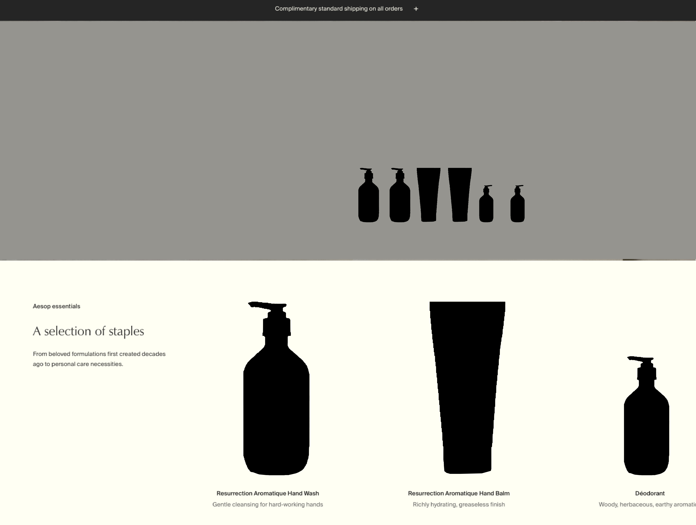
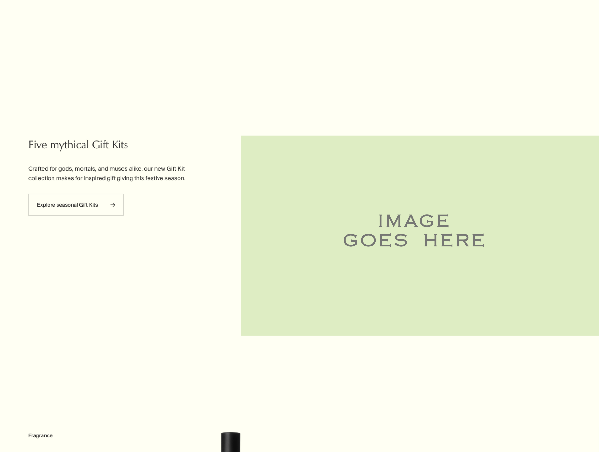
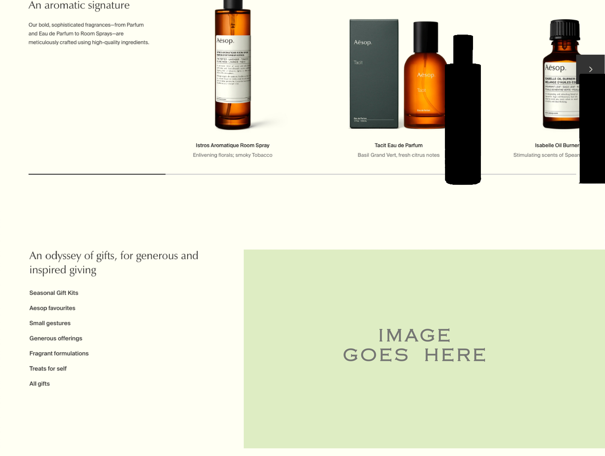
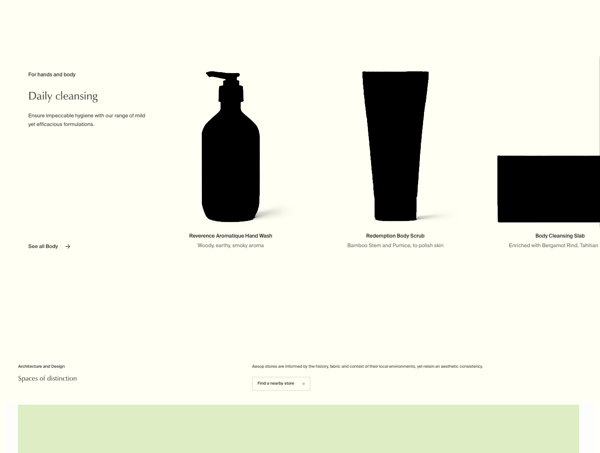
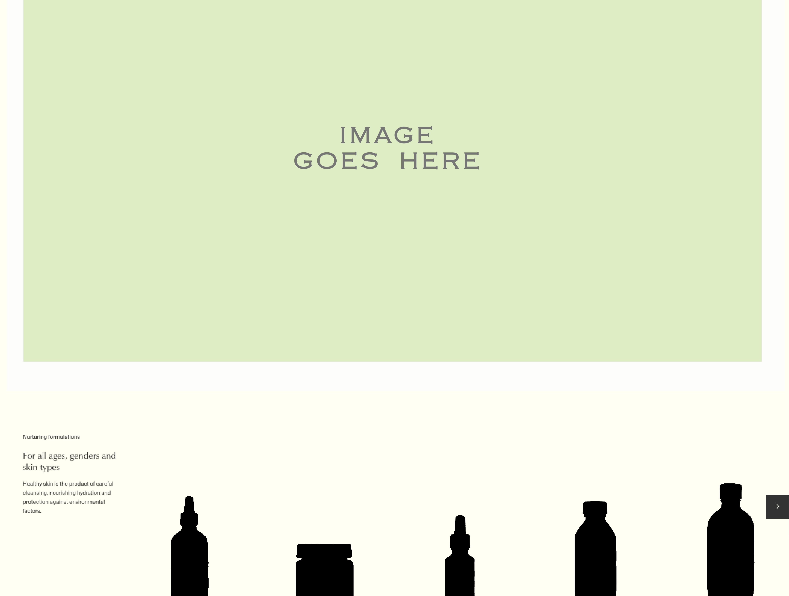
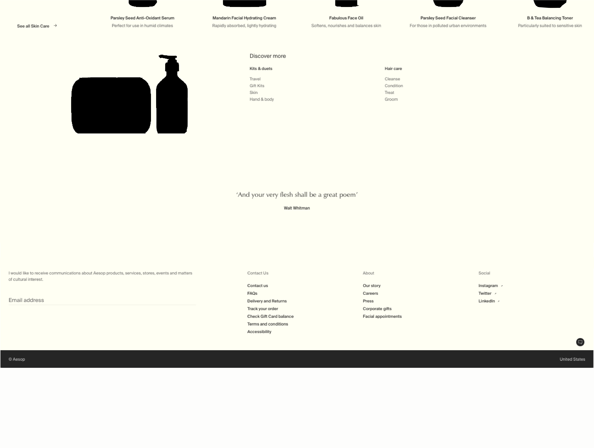

# aesop_mockup

## Collaborators: 
Victor, Rafael & 'Deji.
  https://github.com/mastervic15 |  https://github.com/devrlora  |   https://github.com/DejiADEPETU

  
## DOM Elements;
1. Element#
2. Element#
3. Element#

## Wireframe

## SCHEDULED (OBJECTIVES & GOALS)
Wed:
1. Wireframe        										√ Done
2. 
5. MockUp Prototype 					        			√ Done
 
Thur:
1. Create HTML + CSS Bones    				    			* WorkInProgress(WIP)
2. Create DOM componenets using REACTjs
3. Link components & style pages
 
 
Fri:
1. npm install build
2. Puch final components. & Test
